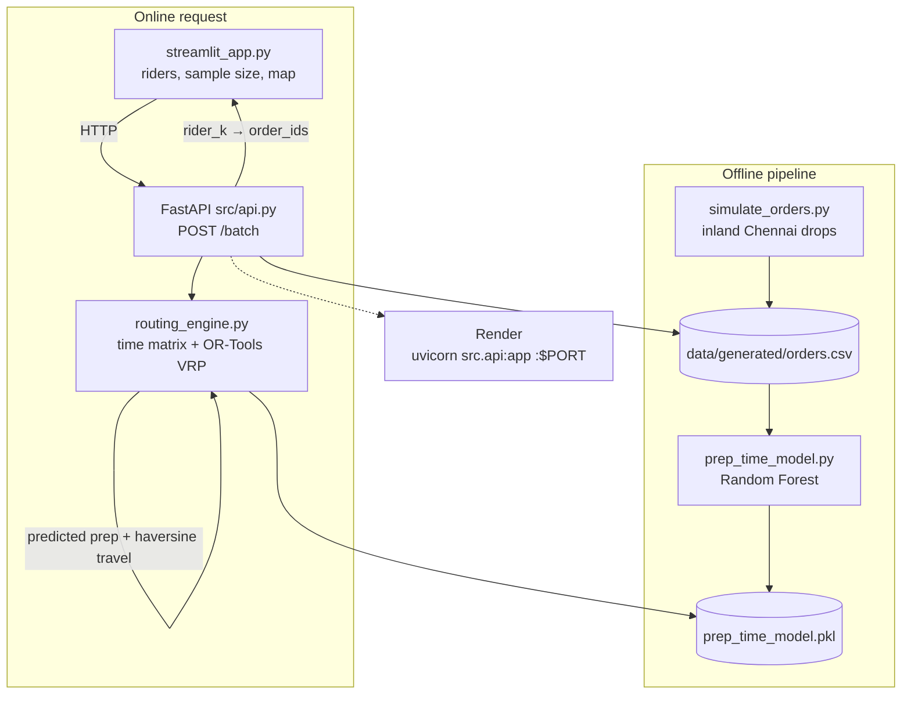
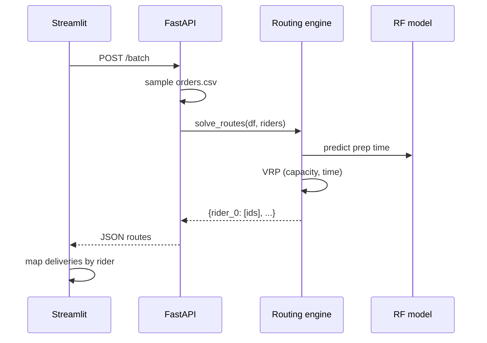

# Quick Commerce Batching

Assigns synthetic Chennai grocery orders to riders. Prep time is predicted with a Random Forest; travel-plus-prep cost is then minimized with an OR-Tools VRP. FastAPI serves assignments; Streamlit plots them on a map.

Live API: [https://quickcommerce-batching.onrender.com](https://quickcommerce-batching.onrender.com)

The point is the **ML → OR handoff**: routing does not use the simulator’s prep-time formula. It uses a model trained on that data, the same way a live system would consume predicted pick-pack minutes.

## Architecture



**Request path**

1. Streamlit posts `num_riders` and `sample_size` to `/batch`.
2. The API samples rows from `orders.csv`.
3. The routing engine predicts pick-pack minutes (`item_count`, `hour`, `store_load`, `distance_km`).
4. It builds a minute-cost matrix: travel between a virtual depot (mean store location) and each drop, plus predicted prep at the destination.
5. OR-Tools assigns orders to riders under capacity (8) and a max route time (300 min).
6. Streamlit joins returned `order_id`s back to lat/lng and draws one color per rider.



| Layer | File | Role |
|---|---|---|
| Data | `src/simulate_orders.py` | 150 inland Chennai orders, 2–6 km from store |
| ML | `src/prep_time_model.py` | Train/save Random Forest |
| OR | `src/routing_engine.py` | Time matrix + VRP |
| API | `src/api.py` | `GET /health`, `POST /batch` |
| UI | `streamlit_app.py` | Controls + Pydeck map |
| Paths | `src/paths.py` | Repo-root paths for CSV/model |
| Host | `Dockerfile`, `render.yaml` | Bind `0.0.0.0:$PORT` |

## Local

```bash
python3 -m venv venv
source venv/bin/activate
pip install -r requirements.txt

python -m src.simulate_orders
python -m src.prep_time_model
python -m src.routing_engine
python tests/test_pipeline.py
```

API (terminal 1):

```bash
uvicorn src.api:app --host 127.0.0.1 --port 8000
```

Map UI (terminal 2):

```bash
streamlit run streamlit_app.py
```

Leave the API URL as `http://127.0.0.1:8000`, then click **Run Batching**.

- `GET /health` — liveness
- `POST /batch?num_riders=5&sample_size=30` — rider assignments
- `GET /docs` — OpenAPI

Deliveries are clipped west of the Chennai coastline so map clusters stay on land.

## Live (Render)

Service: [quickcommerce-batching.onrender.com](https://quickcommerce-batching.onrender.com)

| | |
|---|---|
| Health | https://quickcommerce-batching.onrender.com/health |
| Batch | `POST` https://quickcommerce-batching.onrender.com/batch |
| OpenAPI | https://quickcommerce-batching.onrender.com/docs |
| Dashboard | https://dashboard.render.com/web/srv-da83mprtqb8s73b4b5og |

In Streamlit, set **API URL** to `https://quickcommerce-batching.onrender.com`. The free instance sleeps when idle, so the first request after a pause can take a minute.
